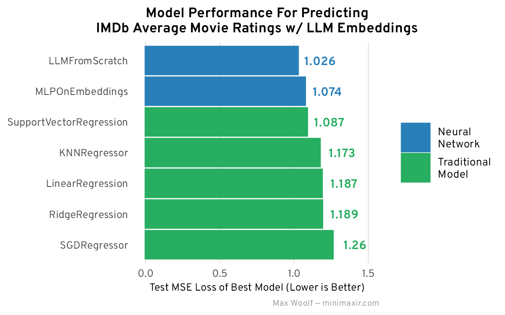

# imdb-embeddings

Jupyter Notebooks and R Notebooks for processing and building models based off of IMDb Movie Embeddings.

This repository is a complement to the blog post [Predicting Average IMDb Movie Ratings Using Text Embeddings of Movie Metadata](https://minimaxir.com/2025/06/movie-embeddings/).

## Maintainer/Creator

Max Woolf ([@minimaxir](https://minimaxir.com))

_Max's open-source projects are supported by his [Patreon](https://www.patreon.com/minimaxir) and [GitHub Sponsors](https://github.com/sponsors/minimaxir). If you found this project helpful, any monetary contributions to the Patreon are appreciated and will be put to good creative use._

## License

MIT
